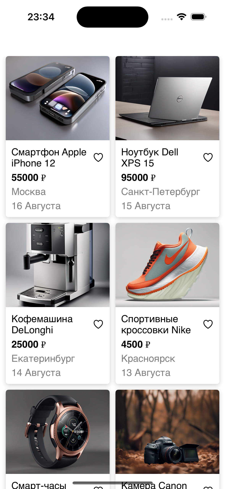
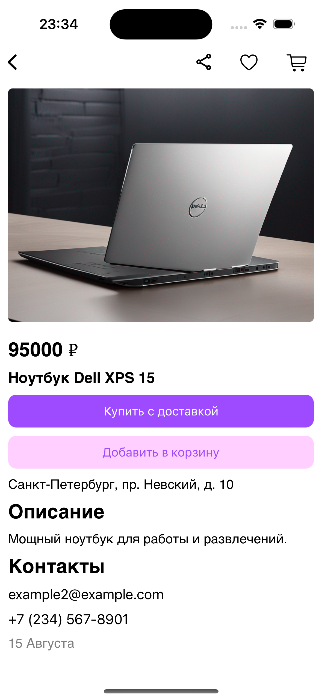

#Тестовое задание для стажёра iOS
Общее описание задания:
Написать приложение для iOS, которое будет состоять из двух экранов:

Список товаров, данный экран будет стартовым.
Детальная карточка товара, будет открываться по нажатию на элемент в списке товаров.
Требование к реализации:
У каждого экрана должно быть три состояния:

Отображение ошибки
Состояние загрузки
Отображение контента из JSON файла
Внешний вид приложения реализовывается на усмотрение кандидата, за референс можно брать приложение Авито. Для каждого экрана нужно будет загружать данные в формате JSON из интернета:

https://www.avito.st/s/interns-ios/main-page.json
URL для запроса на главном экране.
https://www.avito.st/s/interns-ios/details/{itemId}.json
URL для запроса на детальной странице. ID берется из данных для главного экрана.
Пример ссылки: https://www.avito.st/s/interns-ios/details/1.json
Требования к коду:
Приложение написано на языке Swift.
Пользовательский интерфейс приложения реализован кодом без использования SwiftUI.
Для отображения списка используется UICollectionView с отображением в 2 столбца.
Для запроса данных используется URLSession.
Требования к сдаче результатов:
Код должен быть выложен в git-репозиторий на github.com и отправлен нам.
Не забудьте сделать репозиторий публичным, чтобы мы могли его посмотреть.

## Запись экрана 

|  |

## Главный экран и экран товара

| AdvertisementsView      | AdvertisementView       |
| ----------------------- | ----------------------- |
|  |  |
